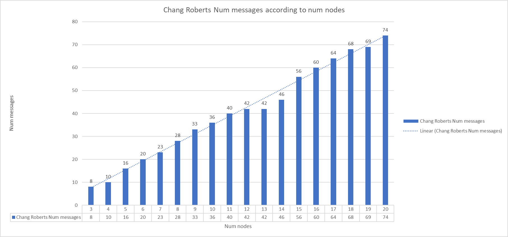
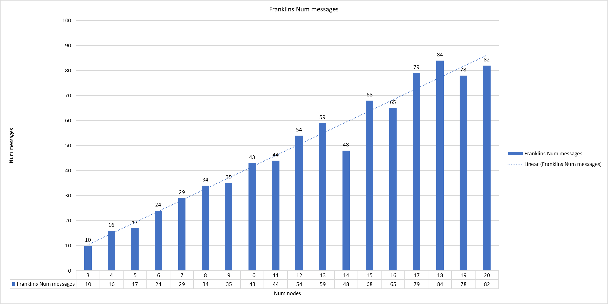

.. include:: substitutions.rst

Implementation, Results and Discussion
======================================

Implementation and Methodology
~~~~~~~~~~~~~~~~~~~~~~~~~~~~~~~~~~~~

In this section, the implementation details and methodologies employed for both the Chang and Roberts Algorithm and Franklin's Algorithm are explored.

**Chang and Roberts Algorithm:**

- Approach: Designed for rings where processes have unique identifiers. Messages with process IDs are circulated, and a process remains active if its own ID is larger than the IDs it receives. The process with the largest ID eventually becomes the leader.
*Advantages:*

- Efficiency Improvement: Notably enhances message complexity compared to basic flooding algorithms, contributing to more streamlined communication in ring networks.
- Straightforward Implementation: Relatively straightforward to implement due to its clear-cut logic and reliance on simple message circulation principles.
*Disadvantages:*

- Message Complexity: Despite being an improvement over basic flooding algorithms, it still exhibits a worst-case message complexity of O(n^2), which can become prohibitive for larger networks.
- Dependency on Unique Identifiers: The algorithm heavily relies on the existence of unique identifiers for each process, limiting its applicability in scenarios where such identifiers are not readily available.

**Franklin's Algorithm:**

- Approach: Designed for bidirectional rings. It uses the concept of "waves" of messages, where a process can start a wave if its ID is larger than its neighbors. Waves travel in both directions, and collisions resolve in favor of the larger ID. Eventually, the largest ID prevails.
*Advantages:*

- Optimized Message Complexity: Offers a significant improvement in terms of message complexity with a worst-case scenario of O(n log n), particularly beneficial for larger ring networks.
- Scalability: Due to its efficient message complexity, it scales well with increasing network size, making it suitable for a wide range of applications.
*Disadvantages:*

- Complex Implementation: Implementation of Franklin's algorithm can be considerably more complex compared to simpler algorithms like Chang and Roberts, requiring a deeper understanding of bidirectional message propagation and collision resolution.
- Communication Channel Requirements: Relies on bidirectional communication channels between neighboring processes, which may pose challenges in certain network architectures where such channels are not readily available or feasible.

Results
~~~~~~~~
**Chang and Roberts Algorithm:**

The simulation results demonstrate that the Chang and Roberts Algorithm effectively elects a leader within directed ring networks. Despite its relatively higher message complexity compared to Franklin’s Algorithm, it showcases robust performance, particularly in scenarios where unique identifiers are readily available.

**Franklin’s Algorithm:**

Similarly, Franklin’s Algorithm exhibits commendable performance, especially in terms of message complexity. The simulation results indicate its ability to efficiently elect a leader within undirected ring networks, making it a suitable choice for scenarios where minimizing message overhead is critical.

Results
-------

**Chang and Roberts Algorithm:**

The simulation results demonstrate that the Chang and Roberts Algorithm effectively elects a leader within directed ring networks. Despite its relatively higher message complexity compared to Franklin’s Algorithm (see Table 1), it showcases robust performance, particularly in scenarios where unique identifiers are readily available (see Figure 1).

**Franklin’s Algorithm:**

Similarly, Franklin’s Algorithm exhibits commendable performance, especially in terms of message complexity. The simulation results indicate its ability to efficiently elect a leader within undirected ring networks (see Table 2), making it a suitable choice for scenarios where minimizing message overhead is critical (see Figure 2).

Results
-------

**Chang and Roberts Algorithm:**

The simulation results demonstrate that the Chang and Roberts Algorithm effectively elects a leader within directed ring networks. Despite its relatively higher message complexity compared to Franklin’s Algorithm (see Table 1), it showcases robust performance, particularly in scenarios where unique identifiers are readily available (see Figure 1).

**Franklin’s Algorithm:**

Similarly, Franklin’s Algorithm exhibits commendable performance, especially in terms of message complexity. The simulation results indicate its ability to efficiently elect a leader within undirected ring networks (see Table 2), making it a suitable choice for scenarios where minimizing message overhead is critical (see Figure 2).

Chang Roberts Algorithm Number of Messages based on Number of Nodes
--------------------------------------------------------

   Chang Roberts Algorithm

Franklin's Algorithm Number of Messages based on Number of Nodes
--------------------------------------------------------

   Franklin's Algorithm

.. list-table:: Chang Roberts
   :widths: 25 25
   :header-rows: 1

   * - Num nodes
     - Num messages
   * - 3
     - 8
   * - 4
     - 10
   * - 5
     - 16
   * - 6
     - 20
   * - 7
     - 23
   * - 8
     - 28
   * - 9
     - 33
   * - 10
     - 36
   * - 11
     - 40
   * - 12
     - 42
   * - 13
     - 42
   * - 14
     - 46
   * - 15
     - 56
   * - 16
     - 60
   * - 17
     - 64
   * - 18
     - 68
   * - 19
     - 69
   * - 20
     - 74

.. list-table:: Franklins
   :widths: 25 25
   :header-rows: 1

   * - Num nodes
     - Num messages
   * - 3
     - 10
   * - 4
     - 16
   * - 5
     - 17
   * - 6
     - 24
   * - 7
     - 29
   * - 8
     - 34
   * - 9
     - 35
   * - 10
     - 43
   * - 11
     - 44
   * - 12
     - 54
   * - 13
     - 59
   * - 14
     - 48
   * - 15
     - 68
   * - 16
     - 65
   * - 17
     - 79
   * - 18
     - 84
   * - 19
     - 78
   * - 20
     - 82

Discussion
~~~~~~~~~~

**Comparative Analysis:**

Comparing the two algorithms, it becomes evident that their suitability depends on various factors such as network topology, message complexity constraints, and availability of unique identifiers for processes.

**Network Topology:** Chang and Roberts Algorithm excels in directed ring networks, leveraging process IDs for efficient leader election. On the other hand, Franklin’s Algorithm performs optimally in undirected ring topologies, offering improved scalability and message complexity management.

**Message Complexity:** While both algorithms aim to minimize message overhead, Franklin’s Algorithm demonstrates superior performance in this aspect, particularly in larger networks. This makes it preferable for scenarios where reducing communication costs is paramount.

**Resource Constraints:** In scenarios where unique identifiers are readily available and the network topology allows for bidirectional communication, Franklin’s Algorithm emerges as an efficient choice. However, in cases where unique identifiers are guaranteed and directed communication is favored, Chang and Roberts Algorithm remains a robust option despite its slightly higher message complexity.